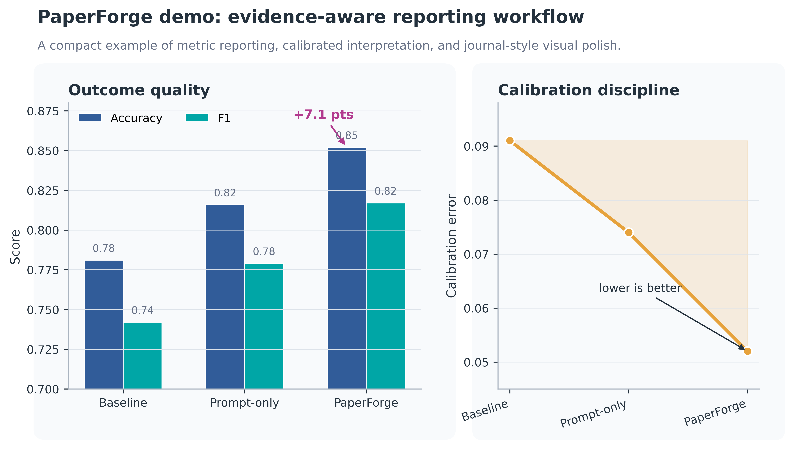

# PaperForge Skills

Research workflow skills for turning rough ideas, experiment outputs, figures,
reviews, and drafts into submission-ready academic work.

PaperForge is designed for researchers who already use an AI coding or writing
agent and want stronger research habits around evidence, figures, reviewer
responses, and final delivery. The skills are project-agnostic: they work from
the files in the current repository or from user-provided notes, tables, drafts,
and review comments.



## Why it exists

Academic AI workflows often fail in the same places: polished prose drifts away
from evidence, figures use inconsistent colors, reviewer replies lose focus,
and final submission folders collect stale drafts and scratch files. PaperForge
turns those recurring problems into reusable agent skills.

## What is included

- `paperforge-delivery`: end-to-end paper/PPT/figure/submission delivery
- `paper-polish`: academic prose revision with claim discipline
- `bilingual-anti-ai-writing`: Chinese-English anti-AI writing skill/checklist for grants, papers, cover letters, and reports
- `figure-style-studio`: publication-style plotting and color guidance
- `results-auditor`: result, metric, split, and claim consistency checks
- `reviewer-response`: rebuttal planning and response writing
- `paper-self-review`: pre-submission quality audit
- `evidence-ranker`: citation and evidence-strength ranking
- `research-ideation`: literature-grounded research idea generation

## Quick demo

Generate the example figure:

```powershell
pip install matplotlib numpy
python examples/make_demo_figure.py
```

The demo reads `examples/demo_results.csv` and writes
`examples/demo_figure.png`. It shows the default PaperForge plotting style:
strong but restrained colors, readable labels, light grid lines, and
publication-oriented spacing.

## Install

Copy the selected skill folders into your Codex skills directory:

```powershell
python scripts/install_skills.py --source skills --target "$env:USERPROFILE\\.codex\\skills"
```

Install one skill:

```powershell
python scripts/install_skills.py --source skills --target "$env:USERPROFILE\\.codex\\skills" --only paper-polish
```

## Validate

```powershell
python scripts/validate_skills.py skills
```

## Example prompts

Use one of these after installing the skills:

```text
Use paperforge-delivery to turn this results folder and manuscript draft into a clean submission bundle.
```

```text
Use figure-style-studio to redraw these result tables as publication-style figures with a consistent palette.
```

```text
Use paper-polish to revise this discussion section so it sounds natural and keeps every claim tied to the evidence.
```

```text
Use bilingual-anti-ai-writing to reduce AI-like wording in this Chinese grant section while preserving technical terms and innovation.
```

```text
Use reviewer-response to classify these reviewer comments and draft a point-by-point response letter.
```

## Project structure

```text
skills/      Installable Codex skill folders
examples/    Small reproducible demo inputs and outputs
scripts/     Install and validation utilities
docs/        Architecture notes
```

See `docs/architecture.md` for the workflow design.

## Design goals

- Work from the files and instructions supplied in the current project
- Make figures and prose more consistent across papers
- Keep claims tied to evidence instead of narrative confidence
- Help authors respond to reviewers with clear, professional revision logic
- Leave a clean, reproducible delivery folder

## License

MIT
